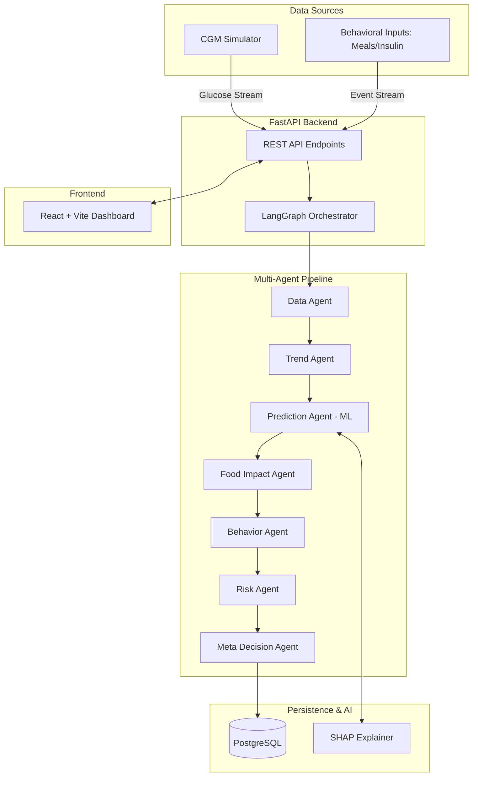
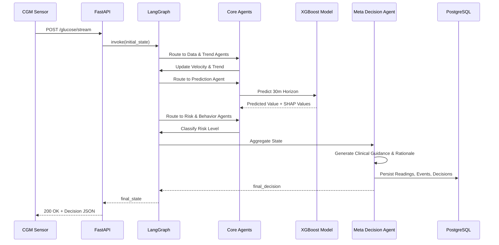
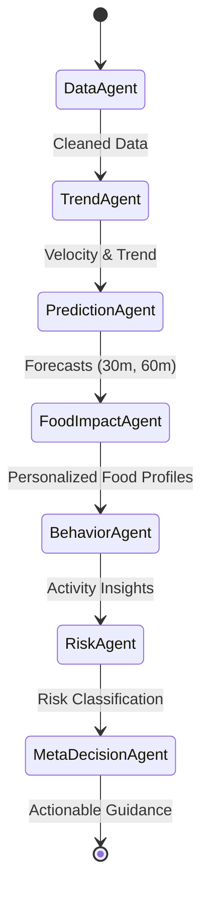

# IMDCS System Architecture & UML

## 1. High-Level Architecture

The system utilizes a microservices-inspired multi-agent architecture orchestrated by LangGraph.

## 2. Sequence Diagram: Data Ingestion to Decision

## 3. LangGraph State Flow

