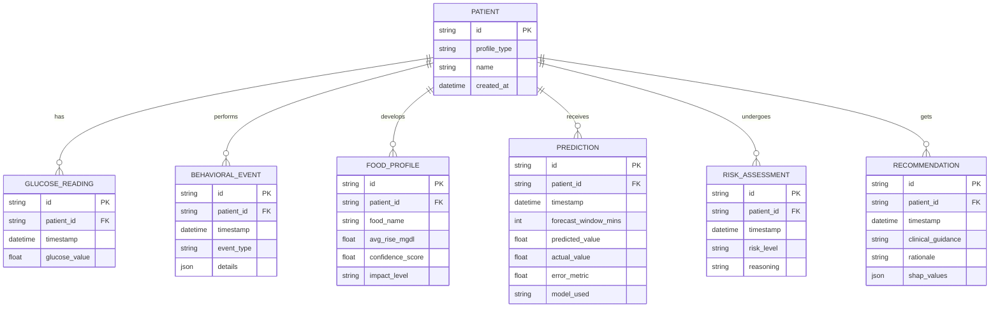

# IMDCS Database Entity Relationship Diagram (ERD)

This document describes the PostgreSQL schema designed for the Intelligent Multi-Agent Diabetes Care System.

```mermaid
erDiagram
    PATIENT ||--o{ GLUCOSE_READING : has
    PATIENT ||--o{ BEHAVIORAL_EVENT : performs
    PATIENT ||--o{ FOOD_PROFILE : develops
    PATIENT ||--o{ PREDICTION : receives
    PATIENT ||--o{ RISK_ASSESSMENT : undergoes
    PATIENT ||--o{ RECOMMENDATION : gets

    PATIENT {
        string id PK
        string profile_type
        string name
        datetime created_at
    }

    GLUCOSE_READING {
        string id PK
        string patient_id FK
        datetime timestamp
        float glucose_value
    }

    BEHAVIORAL_EVENT {
        string id PK
        string patient_id FK
        datetime timestamp
        string event_type
        json details
    }

    FOOD_PROFILE {
        string id PK
        string patient_id FK
        string food_name
        float avg_rise_mgdl
        float confidence_score
        string impact_level
    }

    PREDICTION {
        string id PK
        string patient_id FK
        datetime timestamp
        int forecast_window_mins
        float predicted_value
        float actual_value
        float error_metric
        string model_used
    }

    RISK_ASSESSMENT {
        string id PK
        string patient_id FK
        datetime timestamp
        string risk_level
        string reasoning
    }

    RECOMMENDATION {
        string id PK
        string patient_id FK
        datetime timestamp
        string clinical_guidance
        string rationale
        json shap_values
    }
```
